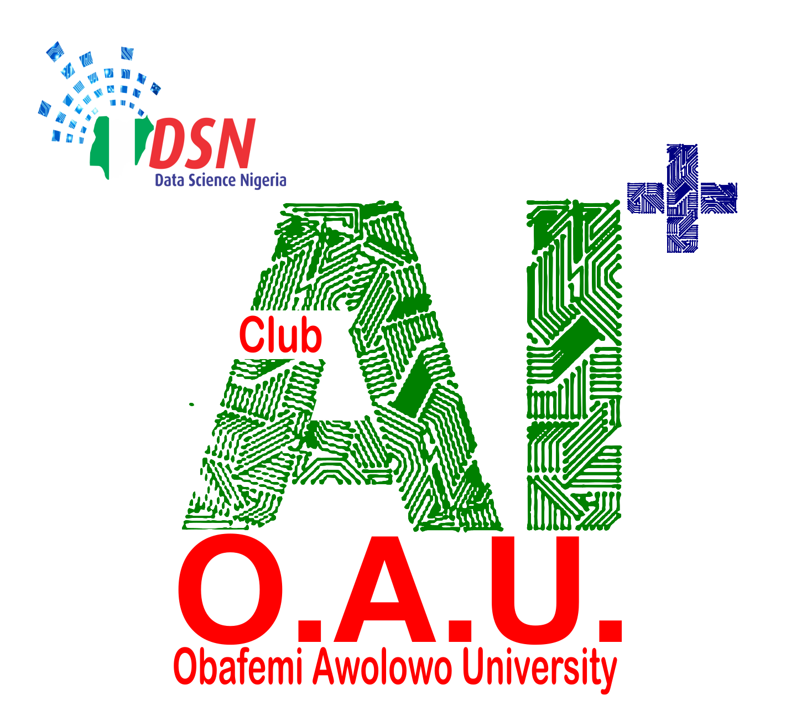

# ML-Algorithm-Challenge

|  | AI+ OAU Algorithm Challenge |
| -------------------------- | --------------------------- |

A lot of data scientists or machine learning enthusiasts do use various machine learning algorithms as a black box without knowing how they work or the mathematics behind it. The purpose of this challenge is to encourage the mathematical understanding of machine learning algorithms, their break and yield point.

In summary, participants are encouraged to understand the fundamental concepts behind machine learning algorithms/models.

The rules and guidelines for this challenge are as follows:

1. Ensure to register at https://bit.ly/oaumlchallenge

2. The algorithm challenge is open to all AI+ OAU Members.

3. Participants are expected to design and develop the K Nearest Neighbour (KNN) algorithm from scratch using Python or R programming.

4. For python developers (numpy is advisable).

5. To push your solution to us, make a [pull request](https://help.github.com/en/github/collaborating-with-issues-and-pull-requests/about-pull-requests) to DSN's GitHub page at https://www.github.com/datasciencenigeria/ML-Logistic-regression-algorithm-challenge. Ensure to add your readme file to understand your code.

6. The top 3 optimized code will be compensated as follows:

- **1st position**: N7000.
- **2nd position**: N5000.
- **3rd position**: N3000.

7. Add your scripts and readme.MD file as a folder saved as your full name (surname_first_middle name) by making a pull request to the repository.

---

For issues on this challenge kindly reach out to the AI+campus/city managers

**WHATSAPP**:

**Paul:** +2348177055301,

**Dunsin:** +2348133331794.

Good luck!
